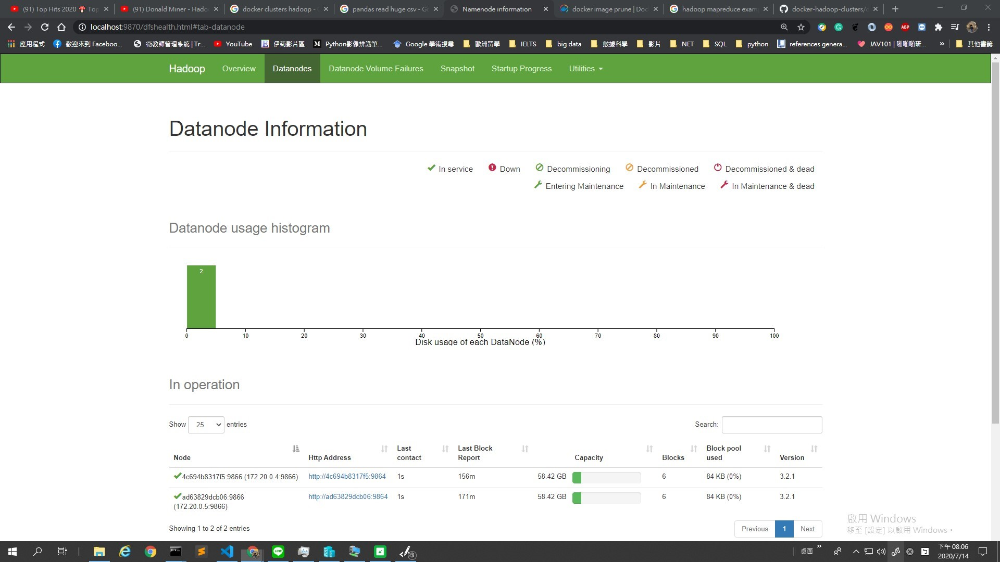

source from:
[](https://gitter.im/big-data-europe/Lobby)


# Changes:

if you wanna add more datanode, just follow the steps below:

## Step1. 
- add a new service --> datanode (Tips: service name & container name should be identical)
***docker-compose.yml***
```docker
  datanode1: # here
    image: bde2020/hadoop-datanode:2.0.0-hadoop3.2.1-java8
    container_name: datanode1 # here 
    restart: always
    volumes:
      - hadoop_datanode1:/hadoop/dfs/data # new volume datanode1
    environment:
      SERVICE_PRECONDITION: "namenode:9870"
    env_file:
      - ./hadoop.env
```
## Step2.
- add a nodemanager managed the datanode above
```docker
  nodemanager2:
    image: bde2020/hadoop-nodemanager:2.0.0-hadoop3.2.1-java8
    container_name: nodemanager2
    restart: always
    environment:
      SERVICE_PRECONDITION: "namenode:9000 namenode:9870 datanode1:9864 resourcemanager:8088"
    env_file:
      - ./hadoop.env
```
- you may figure out that same namenode but different datanode1

## Step3. 
- add the new datanode1 in the environment(SERVICE_PRECONDITION)
```docker
  historyserver:
    image: bde2020/hadoop-historyserver:2.0.0-hadoop3.2.1-java8
    container_name: historyserver
    restart: always
    environment:
      SERVICE_PRECONDITION: "namenode:9000 namenode:9870 datanode:9864 datanode1:9864 resourcemanager:8088" #namenode:9000 namenode:9870
    volumes:
      - hadoop_historyserver:/hadoop/yarn/timeline
    env_file:
      - ./hadoop.env
```
## Step4.
- **DONOT**forget to add new volumes here!
```docker
volumes:
  hadoop_namenode:
  hadoop_datanode:
  hadoop_namenode1:
  hadoop_datanode1:
  hadoop_historyserver:
```
## Step5.
- docker compose up !
```cmd
docker-compose up -d
```
## DONE!



# Reference: 
--
## History:

Version 2.0.0 introduces uses wait_for_it script for the cluster startup

## Hadoop Docker

### Supported Hadoop Versions
See repository branches for supported hadoop versions

### Quick Start

To deploy an example HDFS cluster, run:
```
  docker-compose up
```

Run example wordcount job:
```
  make wordcount
```

Or deploy in swarm:
```
docker stack deploy -c docker-compose-v3.yml hadoop
```

`docker-compose` creates a docker network that can be found by running `docker network list`, e.g. `dockerhadoop_default`.

Run `docker network inspect` on the network (e.g. `dockerhadoop_default`) to find the IP the hadoop interfaces are published on. Access these interfaces with the following URLs:

* Namenode: http://<dockerhadoop_IP_address>:9870/dfshealth.html#tab-overview
* History server: http://<dockerhadoop_IP_address>:8188/applicationhistory
* Datanode: http://<dockerhadoop_IP_address>:9864/
* Nodemanager: http://<dockerhadoop_IP_address>:8042/node
* Resource manager: http://<dockerhadoop_IP_address>:8088/

## Configure Environment Variables

The configuration parameters can be specified in the hadoop.env file or as environmental variables for specific services (e.g. namenode, datanode etc.):
```
  CORE_CONF_fs_defaultFS=hdfs://namenode:8020
```

CORE_CONF corresponds to core-site.xml. fs_defaultFS=hdfs://namenode:8020 will be transformed into:
```
  <property><name>fs.defaultFS</name><value>hdfs://namenode:8020</value></property>
```
To define dash inside a configuration parameter, use triple underscore, such as YARN_CONF_yarn_log___aggregation___enable=true (yarn-site.xml):
```
  <property><name>yarn.log-aggregation-enable</name><value>true</value></property>
```

The available configurations are:
* /etc/hadoop/core-site.xml CORE_CONF
* /etc/hadoop/hdfs-site.xml HDFS_CONF
* /etc/hadoop/yarn-site.xml YARN_CONF
* /etc/hadoop/httpfs-site.xml HTTPFS_CONF
* /etc/hadoop/kms-site.xml KMS_CONF
* /etc/hadoop/mapred-site.xml  MAPRED_CONF

If you need to extend some other configuration file, refer to base/entrypoint.sh bash script.
